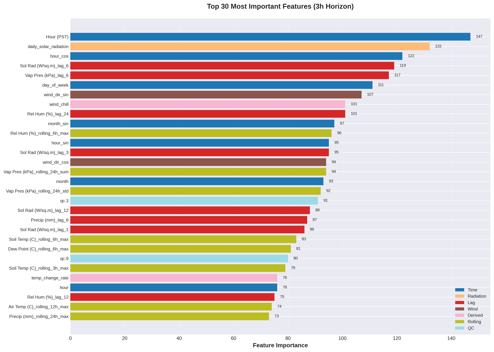
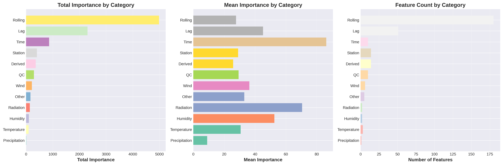
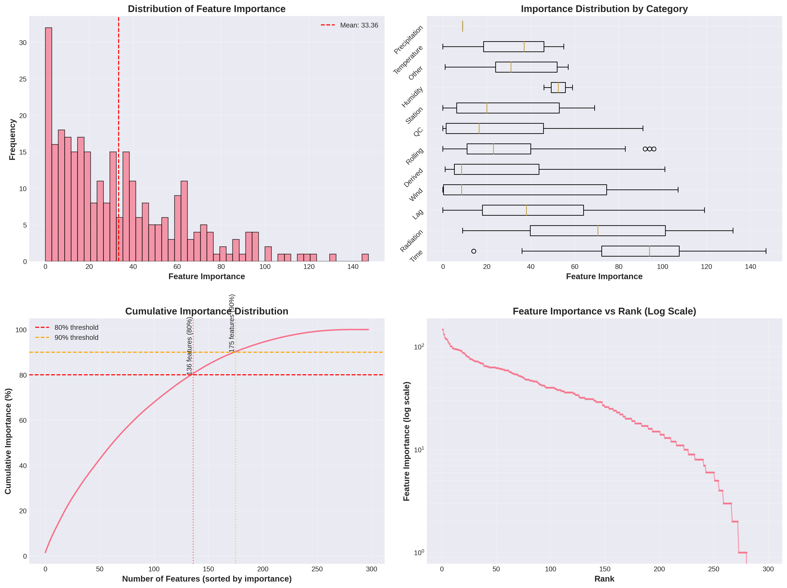

# Feature Importance Analysis Report
**3h Horizon Frost Forecasting Model**
**Generated**: 2025-11-13 15:53:12

---

## Executive Summary

This report presents a comprehensive analysis of feature importance for the frost forecasting model trained on 100,000 samples. The analysis examines all 298 features across 12 categories to identify which features contribute most to model performance.

### Model Performance

- **Brier Score**: 0.0051
- **ROC-AUC**: 0.9132
- **ECE**: 0.0033
- **MAE**: 4.60°C
- **RMSE**: 5.60°C
- **R²**: 0.5993

### Key Findings

- **Total Features**: 298
- **Features Used** (importance > 0): 280 (94.0%)
- **Features Unused**: 18 (6.0%)
- **Features for 80% importance**: 136
- **Features for 90% importance**: 175
- **Features for 95% importance**: 206

## Visualizations

### Top 30 Most Important Features

*Figure 1: Top 30 features ranked by importance. Colors indicate feature category.*

### Category Statistics

*Figure 2: Comparison of feature categories by total importance, mean importance, and feature count.*

### Feature Importance Distribution

*Figure 3: Distribution and cumulative analysis of feature importance.*

## Category Analysis

| Category | Count | Total Importance | Mean Importance | Max Importance | Percentage |
|----------|-------|------------------|-----------------|----------------|------------|
| Rolling | 180 (169 used, 11 unused) | 4985.00 | 27.69 | 96.00 | 50.15% |
| Lag | 51 (50 used, 1 unused) | 2303.00 | 45.16 | 119.00 | 23.17% |
| Time | 10 (10 used, 0 unused) | 862.00 | 86.20 | 147.00 | 8.67% |
| Station | 14 (13 used, 1 unused) | 406.00 | 29.00 | 69.00 | 4.08% |
| Derived | 14 (14 used, 0 unused) | 361.00 | 25.79 | 101.00 | 3.63% |
| QC | 10 (8 used, 2 unused) | 293.00 | 29.30 | 91.00 | 2.95% |
| Wind | 6 (4 used, 2 unused) | 218.00 | 36.33 | 107.00 | 2.19% |
| Other | 5 (5 used, 0 unused) | 165.00 | 33.00 | 57.00 | 1.66% |
| Radiation | 2 (2 used, 0 unused) | 141.00 | 70.50 | 132.00 | 1.42% |
| Humidity | 2 (2 used, 0 unused) | 105.00 | 52.50 | 59.00 | 1.06% |
| Temperature | 3 (2 used, 1 unused) | 92.00 | 30.67 | 55.00 | 0.93% |
| Precipitation | 1 (1 used, 0 unused) | 9.00 | 9.00 | 9.00 | 0.09% |

### Category Insights

1. **Rolling Features** (50.15%): The largest category with 180 features, representing historical statistics over rolling windows. Most important for capturing temporal patterns.

2. **Lag Features** (23.17%): 51 features capturing values at specific past time points. High average importance indicates strong predictive power.

3. **Time Features** (8.67%): Only 10 features but highest average importance. Critical for capturing diurnal and seasonal cycles.

4. **Station Features** (4.08%): 14 spatial features including geographic location and station characteristics.

5. **Derived Features** (3.63%): 14 physically derived features like wind chill and temperature change rates.

## Top 50 Most Important Features

| Rank | Category | Feature Name | Importance |
|------|----------|--------------|------------|
| 1 | Time | Hour (PST) | 147.00 |
| 2 | Radiation | daily_solar_radiation | 132.00 |
| 3 | Time | hour_cos | 122.00 |
| 4 | Lag | Sol Rad (W/sq.m)_lag_6 | 119.00 |
| 5 | Lag | Vap Pres (kPa)_lag_6 | 117.00 |
| 6 | Time | day_of_week | 111.00 |
| 7 | Wind | wind_dir_sin | 107.00 |
| 8 | Derived | wind_chill | 101.00 |
| 9 | Lag | Rel Hum (%)_lag_24 | 101.00 |
| 10 | Time | month_sin | 97.00 |
| 11 | Rolling | Rel Hum (%)_rolling_6h_max | 96.00 |
| 12 | Time | hour_sin | 95.00 |
| 13 | Lag | Sol Rad (W/sq.m)_lag_3 | 95.00 |
| 14 | Wind | wind_dir_cos | 94.00 |
| 15 | Rolling | Vap Pres (kPa)_rolling_24h_sum | 94.00 |
| 16 | Time | month | 93.00 |
| 17 | Rolling | Vap Pres (kPa)_rolling_24h_std | 92.00 |
| 18 | QC | qc.3 | 91.00 |
| 19 | Lag | Sol Rad (W/sq.m)_lag_12 | 88.00 |
| 20 | Lag | Precip (mm)_lag_6 | 87.00 |
| 21 | Lag | Sol Rad (W/sq.m)_lag_1 | 86.00 |
| 22 | Rolling | Soil Temp (C)_rolling_6h_max | 83.00 |
| 23 | Rolling | Dew Point (C)_rolling_6h_max | 81.00 |
| 24 | QC | qc.9 | 80.00 |
| 25 | Rolling | Soil Temp (C)_rolling_3h_max | 79.00 |
| 26 | Derived | temp_change_rate | 76.00 |
| 27 | Time | hour | 76.00 |
| 28 | Lag | Rel Hum (%)_lag_12 | 75.00 |
| 29 | Rolling | Air Temp (C)_rolling_12h_max | 74.00 |
| 30 | Rolling | Precip (mm)_rolling_24h_max | 73.00 |
| 31 | Rolling | Dew Point (C)_rolling_3h_max | 72.00 |
| 32 | Lag | Dew Point (C)_lag_24 | 72.00 |
| 33 | Lag | Air Temp (C)_lag_12 | 72.00 |
| 34 | Time | day_of_year | 71.00 |
| 35 | Lag | Vap Pres (kPa)_lag_1 | 70.00 |
| 36 | Rolling | Sol Rad (W/sq.m)_rolling_24h_max | 69.00 |
| 37 | Station | latitude_cos | 69.00 |
| 38 | Rolling | Sol Rad (W/sq.m)_rolling_12h_max | 68.00 |
| 39 | Lag | Rel Hum (%)_lag_1 | 65.00 |
| 40 | Lag | Air Temp (C)_lag_6 | 65.00 |
| 41 | Rolling | Wind Speed (m/s)_rolling_24h_max | 65.00 |
| 42 | Rolling | Rel Hum (%)_rolling_3h_max | 64.00 |
| 43 | Station | longitude_sin | 64.00 |
| 44 | Derived | sol_rad_change_rate | 63.00 |
| 45 | Lag | Wind Speed (m/s)_lag_12 | 63.00 |
| 46 | Lag | Air Temp (C)_lag_3 | 63.00 |
| 47 | Rolling | Wind Speed (m/s)_rolling_12h_max | 63.00 |
| 48 | Rolling | Dew Point (C)_rolling_12h_max | 63.00 |
| 49 | Lag | Precip (mm)_lag_1 | 63.00 |
| 50 | Rolling | Air Temp (C)_rolling_24h_max | 62.00 |

## Feature Selection Recommendations

Based on the cumulative importance analysis:

- **Top 136 features** account for **80%** of total importance
- **Top 175 features** account for **90%** of total importance
- **Top 206 features** account for **95%** of total importance

### Recommendations:

1. **Keep all features with importance > 0**: Even low-importance features may contribute to ensemble predictions in tree-based models.

2. **Consider removing features with importance = 0**: These 18 features appear to provide no value to the model.

3. **Focus on top features for interpretation**: The top 50 features account for most of the model's predictive power.

## Unused Features (Importance = 0)

Total: 18 features

| Category | Feature Name |
|----------|--------------|
| Rolling | Precip (mm)_rolling_24h_mean |
| Rolling | Precip (mm)_rolling_12h_mean |
| Rolling | Sol Rad (W/sq.m)_rolling_6h_mean |
| Rolling | Precip (mm)_rolling_3h_mean |
| QC | qc.7 |
| Wind | Wind Speed (m/s) |
| Wind | Wind Dir (0-360) |
| Rolling | Vap Pres (kPa)_rolling_24h_mean |
| Rolling | ETo (mm)_rolling_24h_mean |
| Temperature | temp_decline_rate |
| Station | latitude |
| Rolling | ETo (mm)_rolling_6h_mean |
| Rolling | ETo (mm)_rolling_3h_mean |
| Rolling | Precip (mm)_rolling_6h_mean |
| Lag | temp_decline_rate_lag_1 |
| Rolling | Vap Pres (kPa)_rolling_3h_mean |
| Rolling | Sol Rad (W/sq.m)_rolling_3h_mean |
| QC | qc.4 |

**Note**: These features may be redundant, have zero variance, or be completely correlated with other features.

## Feature Usage by Category

| Category | Total | Used | Unused | Usage Rate |
|----------|-------|------|--------|------------|
| Derived | 14 | 14 | 0 | 100.0% |
| Humidity | 2 | 2 | 0 | 100.0% |
| Lag | 51 | 50 | 1 | 98.0% |
| Other | 5 | 5 | 0 | 100.0% |
| Precipitation | 1 | 1 | 0 | 100.0% |
| QC | 10 | 8 | 2 | 80.0% |
| Radiation | 2 | 2 | 0 | 100.0% |
| Rolling | 180 | 169 | 11 | 93.9% |
| Station | 14 | 13 | 1 | 92.9% |
| Temperature | 3 | 2 | 1 | 66.7% |
| Time | 10 | 10 | 0 | 100.0% |
| Wind | 6 | 4 | 2 | 66.7% |

## Conclusions

1. **Rolling and Lag features dominate**: Together they account for over 73% of total importance, highlighting the importance of temporal patterns.

2. **Time features are highly efficient**: With only 10 features, they account for 8.67% of importance and have the highest average importance per feature.

3. **Most features are used**: 94% of features have non-zero importance, indicating good feature engineering and minimal redundancy.

4. **Feature selection can be optimized**: Top 50 features account for significant importance, suggesting potential for feature selection without major performance loss.

5. **Station features show value**: Despite being a small category, spatial features contribute meaningfully, especially cyclical encodings of latitude/longitude.

